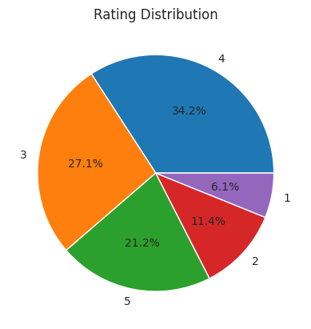

# Introduction

The task of this assignment is to build a recommendation system
using [MovieLens 100K dataset](https://grouplens.org/datasets/movielens/100k/).

# Data analysis

## User features

### Gender

Most of the users in the dataset are male. This imbalance accounts when analysing other features
against gender, so I used per-group normalization on later plots (see first notebook for more
technical details).

### Age

We can see that the most of the users are quite young (with mode age around 30). This holds for both
genders. However, there are some differences when we plot ages against gender. For example, female
users around 20 and 40-55 ages noticeably more frequent.

### Occupation

The most popular occupation is student, which agrees with the fact that most of the users are young.

We can see on the plot above some correlations between age and occupation. For example, student or
retired persons have narrow age range, while other occupations are have broader age range.

We can see on the plot above some correlations between gender and occupation. For example,
technicians and engineers are more frequent among males than females.

### Zip codes

Zip code is not very useful as raw feature: it is categorical feature with almost no repetitions.
But it is
possible to extract geographical information from them:

Also, they have hierarchical structure, so taking first 1-3 symbols can provide the geographical
information as well. You can see example of it in [this live demo](https://benfry.com/zipdecode/).

## Other features

### Rating

As we can see on the plot above, roughly a half of the ratings are positive (4 and 5).

# Model Implementation

## Selected model

I decided to use LightFM model because it is hybrid model. It means that this model combines
collaborative filtering with content-based approach.

## Feature selection and preprocessing

Since it is hard to make LightFM work with something other than categorical features, I decided to
use only them.

### User features

I started with `gender` and `occupation` features since they are already categorical.

Then I added `age_group` feature, which was created from `age` feature by cutting it in 4
intervals, this addition improved metrics of the model.

Then I tried to incorporate `zip_code` feature into the model. I took zip code prefixes as I
described earlier, but it made the model perform worse.

### Item features

I used only `genre` feature for movies.

# Model Advantages and Disadvantages

## Advantages

- It is a hybrid model.
- Fast and easy to train.

## Disadvantages

- Hard to make it work with non-categorical features.
- Model perform worse if negative interactions are used in dataset.
- Heavily depends on feature quality. Adding one feature can significantly reduce the performance,
  like it was with zip codes.
- Trying to run it in multiple threads results in results that cannot be reproduced, so I set the
  count of threads to 1 everywhere.

# Training Process

Model was trained on first train/test split (`u1.base` and `u1.test`) during 30 epochs.

During the training process, the model had the following metric values:

# Evaluation

I decided to use all builtin metrics from LightFM library: precision at k, recall at k, and AUC
score.
Also, I added F1 score calculated from precision and recall.

# Results

Metrics values for `u1.test` calculated using evaluate script:

| Metric       | Value  |
|--------------|--------|
| Precision@20 | 0.2843 |
| Recall@20    | 0.3040 |
| F1@20        | 0.2938 |
| AUC          | 0.9293 |

These metric values are quite good. For example, for random guess (when I broke the model with
invalid dataset :) ), I got AUC around 0.5, while precision and recall was less than 0.1.

I tried looking at what items the model recommends for particular user,
and these recommendations are adequate. See the second notebook for more details.
