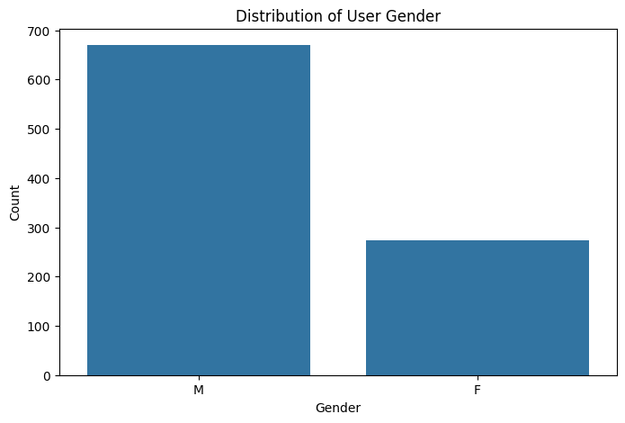
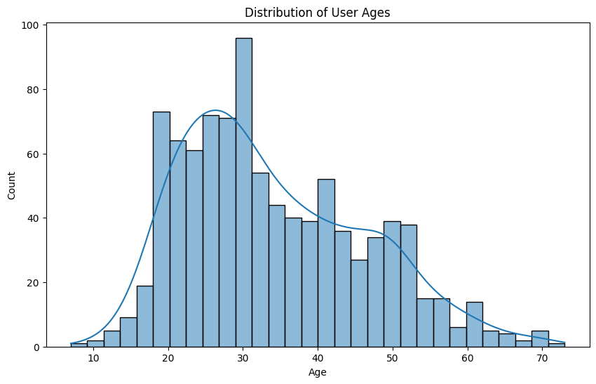
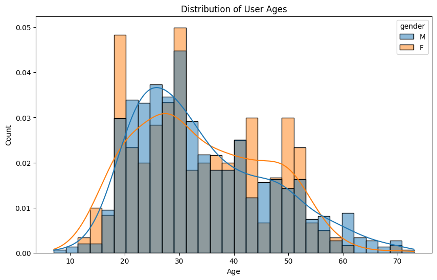
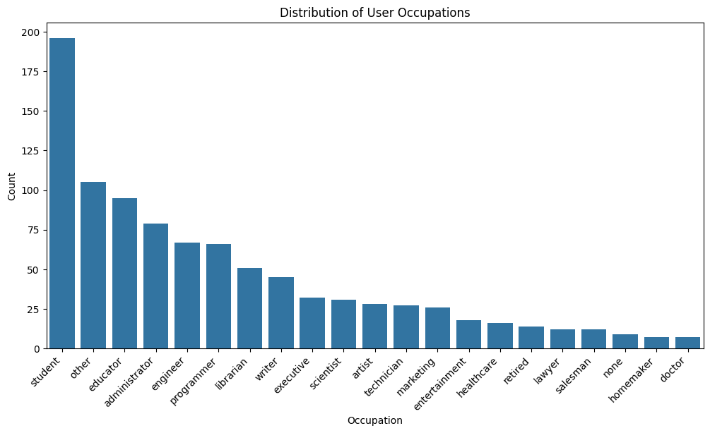
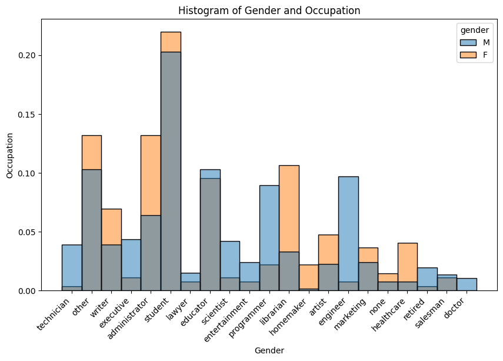
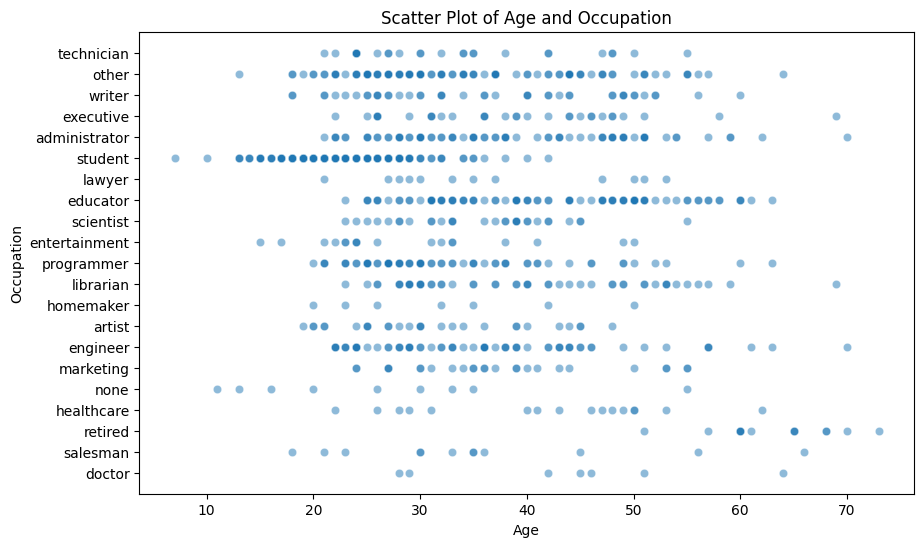
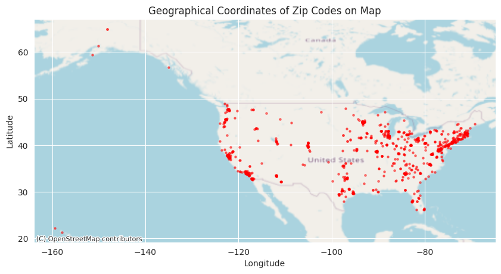
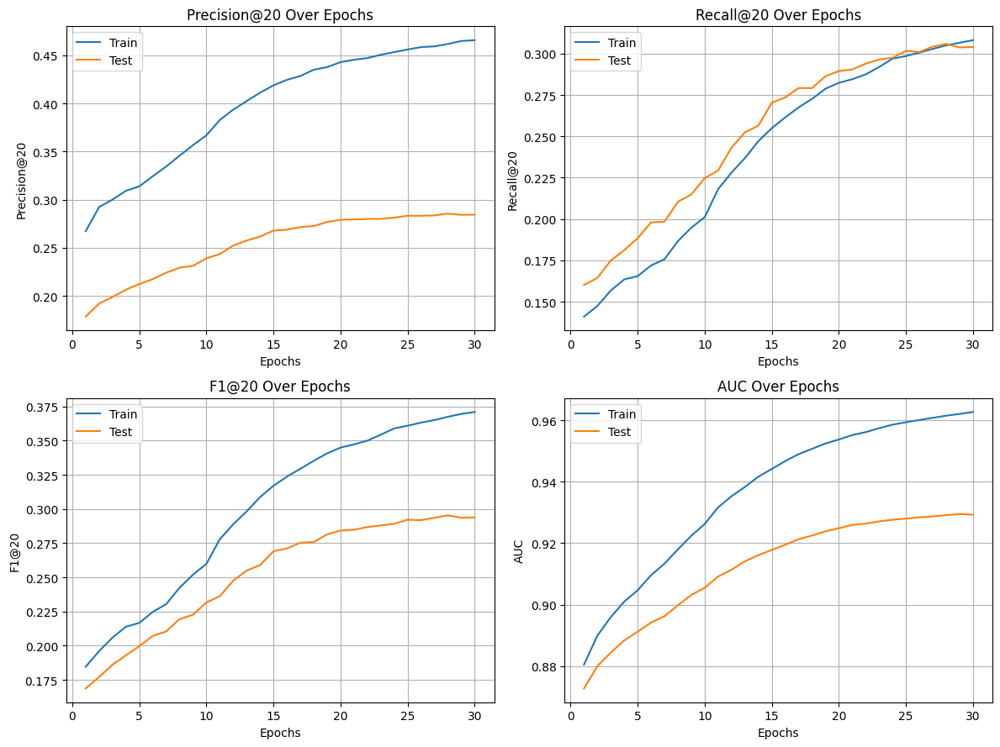

# Introduction

The task of this assignment is to build a recommendation system using [MovieLens 100K dataset](https://grouplens.org/datasets/movielens/100k/). ...

# Data analysis

## User features

### Gender

### Age

### Occupation

### Zip codes

Zip code is not very useful as raw feature: it is categorical feature with almost no repetitions.
But it is
possible to extract geographical information from them:

Also, they have hierarchical structure, so taking first 1-3 symbols can provide the geographical
information as well. You can see example of it in [this live demo](https://benfry.com/zipdecode/).

## Other features

# Model Implementation

## Selected model

I decided to use LightFM model. ...

## Feature selection and preprocessing

Since it is hard to make LightFM work with something other than categorical features, I decided to
use only them.

### User features

I started with `gender` and `occupation` features since they are already categorical.

Then I added `age_group` feature, which was created from `age` feature by cutting it in 4
intervals, this addition improved metrics of the model.

Then I tried to incorporate `zip_code` feature into the model. I took zip code prefixes as I
described earlier, but it made the model perform worse.

### Item features

I used only `genre` feature for movies.

# Model Advantages and Disadvantages

## Advantages
- It can handle additional features for users and items.
- ...

## Disadvantages
- Hard to make it work with non-categorical features.
- Model perform worse if negative interactions are used in dataset.
- ...

# Training Process

Model was trained on first train/test split (`u1.base` and `u1.test`).

During the training process, ...

# Evaluation

I decided to use all builtin metrics from LightFM library: precision at k, recall at k, and AUC
score.
Also, I added F1 score calculated from precision and recall.

# Results

Metrics values for `u1.test`:

| Metric       | Value  |
|--------------|--------|
| Precision@20 | 0.2843 |
| Recall@20    | 0.3040 |
| F1@20        | 0.2938 |
| AUC          | 0.9293 |

